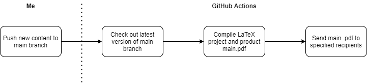

Merry Christmas folks! Hope y'all are enjoying the festivities together with your loved ones (as much as your country's regulations allow it of course). Christmas
time for us is always very calm since we do not really celebrate it. This time, I am working on my master thesis and, like a true student, I found a way to procrastinate.
  
# Introduction

Mostly all of my academic papers are written with LaTeX, which is, according to its <a href="https://www.latex-project.org/" target="_blank" rel="noreferrer">official website</a>,
"a high-quality typesetting system" that "includes features designed for the production of technical and scientific documentation". The hassle with LaTeX though is that you have
to compile your documents each time you want to see a simple .pdf file. Additionally, my thesis supervisor needs to be kept in the loop whenever I add new content to my thesis.
Thus, each time I would add some bigger changes, I need to compile the document, create the .pdf, go to Google Mail, write the mail, find and attach the compiled document,
and lastly hit send. Kinda annoying.

Recently, I finished reading <i>The Effective Engineer</i> by Edmund Lau, CEO of Quip and former CTO of Facebook. In it, he urges to use automation to increase the speed of iterations.
In this case, an iteration would be the time it takes to, e.g., write a new section in my thesis and get the feedback of my supervisor. Writing the actual thesis is fine, but creating a .pdf file sending it
over to my supervisor is annoying. So why not automate everything that is not related to the actual writing of the thesis?

> As a rule of thumb, once I've manually performed a task three or more times, I start thinking about whether it would be worthwile to automate it.
>
> <cite>Edmund Lau</cite>

Personally, I always use <a href="https://www.overleaf.com/" target="_blank" rel="noreferrer">Overleaf</a> to compile my documents. It is basically the Google Docs of LaTeX,
meaning it comes along with templates, cloud storage, online collaboration, and so on. The solution below should also work in case you prefer to work with LaTeX on your own machine.

# Preparations

In order for this to work, following prerequisites are needed:

- A GitHub account and a bit of Git knowledge
- LaTeX installed locally or an Overleaf account
- An E-Mail account

First, create a repository on GitHub. It doesn't matter if it's public or private. Secondly, push an initial version of your LaTeX document into your newly
created repository. In case you are using Overleaf, just create a new project and <a href="https://www.overleaf.com/learn/how-to/Using_Git_and_GitHub" target="_blank" rel="noreferrer">follow these steps to sync the project with GitHub</a>
(see section "Creating a new GitHub repository from an Overleaf project").

Once you created a repository and added an initial version of your document in it, we can start automating all the boring stuff. To do so, we will be using <a href="https://github.com/features/actions" target="_blank" rel="noreferrer">GitHub Actions. </a>
Actions are workflows triggered by certain events, such as a push into a repository. Your defined workflows are executed on <i>runners</i>, which can be Linux, macOS, Windows virtual machines or containers.
For our automated LaTeX compilation we will be using Cheng XU's <a href="https://github.com/xu-cheng/latex-action" target="_blank" rel="noreferrer">LaTeX action</a>, and Dawid Dziurla's <a href="https://github.com/dawidd6/action-send-mail" targe="_blank" rel="noreferrer">email action</a>
to send the compiled .pdf file to our recipients. The image below illustrates our workflow. The action is triggered after each push and automatically checks out the latest version of the main branch. It then proceeds to create and send the .pdf file. 



# Creating your GitHub workflow

In your repository's page, click the "Actions" tab. Select the option to create your own workflow. Then, focus only on the editor on the left.
First, we need to give our action a name. Add:

```yaml
name: Build LaTeX .pdf
``` 

This will be the name of your workflow and later on be displayed in the <i>Actions</i> tab. In order to invoke the action after each push to the main branch, add:

```yaml
on:
  push:
    branches: [ main ]
```

Before we can use the above mentioned actions to compile our LaTeX project and send an email, we need to specify on what kind of <i>runner</i> our action will be invoked:

```yaml
jobs:
  build:
    # The type of runner that the job will run on
    runs-on: ubuntu-latest
```

Now the steps! Remember, there are three steps (see workflow image above): checking out the latest version of the main branch (1), compiling your LaTeX project and producing the .pdf (2),
and finally sending the created .pdf to your recipients (3). For step one, add this snippet with the same indent as `runs-on` above.

```yaml
    steps:
      - name: Check out latest version of main branch
      - uses: actions/checkout@v2
```

Next step, the "core" of this action, has to be added below. Note: it needs to have the same indent as the step above. The snippet runs the LaTeX compilation
with the main latex file as the only argument. To see a full list of the requirements, refer to the <a href="https://github.com/xu-cheng/latex-action" target="_blank" rel="noreferrer">action's repository</a>.

```yaml
      - name: Github Action for LaTeX
        uses: xu-cheng/latex-action@v2
        with:
          root_file: testy.tex
```

The produced .pdf file will have the same name as your main file. Note: According to the documentation, it's possible to specify multiple root files. However, I didn't try that out, thus don't know how the
naming of the result .pdf file would look like.

Once the compilation step is done, we have a .pdf file `testy.pdf`. The last step is to email the newly created file to your recipients. Add:

```yaml
      - name: Send mail
        uses: dawidd6/action-send-mail@v2
        with:
          server_address: smtp.gmail.com
          server_port: 465
          username: ${{secrets.MAIL_USERNAME}}
          password: ${{secrets.MAIL_PASSWORD}}
          subject: Thesis changes
          body: |+
            Hi there! 
            
            I updated my document. Below, you can find my current thoughts on it: 
            
            ${{ github.event.head_commit.message }}

            Let me know what you think! :) 
            
            Kind regards,
            
            Dalje-et
          to: first.recipient@gmail.com,second.recipient@outlook.com
          from: Dalje-et
          content_type: text/html
          convert_markdown: true
          attachments: ./testy.pdf
```

There are multiple things happening here. First, a smtp server is defined in order to specify the origin mail address. I use <a href="https://docs.github.com/en/free-pro-team@latest/actions/reference/encrypted-secrets" target="_blank" rel="noreferrer">GitHub Secrets</a> to store my credentials. <b>Do not</b>
paste in your credentials as free text. They will be visible in the GitHub history. <br />
Next in line are the subject, email body, and recipients. In the email body, I make use of the last commit's message to add some content to my mail. That way, my auto-generated
mails never look identical and I can add a small changelog into the mail. For that reason, I set the `convert_markdown` flag to convert my commit message from markdown
to HTML. Lastly, we specify our attachment, the previously created `testy.pdf`.

# Conclusion

The only step left is to commit your workflow into your repository. Afterwards, check the <i>Actions</i> tab in your repository. Your workflow should be visible now.
I created a <a href="https://github.com/Dalje-et/LaTeX-Compilation-Demo" target="_blank" rel="noreferrer">demo repository</a> where you can find the complete .yaml file. Note that 
you can add more steps to your workflow, e.g., to upload the file automatically to a Dropbox folder. Check out the GitHub Actions Marketplace for more possibilities. Lastly,
here is a video showing how the workflow would look like when using Overleaf:

<figure>
  <video controls="true">
    <source src="./github_action.mp4" type="video/mp4" alt="GitHub Workflow in Action" />
  </video>
</figure>

That's it! I should head back to my thesis now 😅.

Cheers!


